# Vagabond: Multi-Modal Travel Assistant

Vagabond is a responsive, multi-modal travel assistant powered by a custom **LangGraph** orchestration backend and an interactive **Streamlit** user interface. It aggregates city facts, daily weather forecasts, and high-quality destination imagery, presenting them in a beautiful, unified dashboard.

Designed to showcase advanced agentic concepts, Vagabond implements intelligent vector database routing, parallelized fetch operations, custom (manual) tool execution, and state checkpointing memory for context-aware follow-up queries.

---

## Key Features & Architecture

### 1. LangGraph Orchestration (Orchestration & State)
The workflow is defined as a directed state graph using **LangGraph**. The state is managed via a typed schema (`TravelState`) containing fields for the target city, query text, summaries, forecasts, and fetched media.

### 2. Intelligent Routing (The "Switch")
The agent does not blindly query external web search APIs for every question. Instead:
- A local **FAISS Vector Database** is pre-populated with detailed travel facts for starter cities (Paris, Tokyo, and New York) using custom **Deterministic Embeddings**.
- A routing edge checks for knowledge availability. If the query city exists in the local database, it fetches from the vector store (`vector_retrieve` path).
- If the city is missing (e.g. Sydney), it routes dynamically to the web search node (`web_search` path), executing search queries using DuckDuckGo.

### 3. Parallel Fetching (Fan-Out & Fan-In)
Weather retrieval and image searches are independent. To minimize overall user latency, these fetches execute in parallel nodes (`fetch_weather` and `fetch_images`) instead of sequentially. Once both finish, their states are synchronized and merged into the compilation node.

### 4. Custom Tool Execution (Manual Transmission)
Rather than relying on high-level framework wrappers like `create_tool_calling_agent` or `prebuilt.ToolNode`, the agent explicitly parses the state payload, invokes the custom tool methods, and updates the state. This exhibits granular control over LLM tool-calling events.

### 5. Memory & Context Preservation (Time Travel)
Using a LangGraph `MemorySaver` checkpointer, conversation states are persisted for each unique thread ID. 
- If a user queries `"Tokyo"` and subsequently follow up with `"What about next week?"`, the initialization node checks if a city context is already loaded.
- Recognizing the city context remains Tokyo but the intent changed to a weather forecast update, it routes straight to the weather fetcher, **skipping** the city summary database or search retrieval.

---

## 📊 Graph Topology Diagram

GitHub and modern markdown engines natively render Mermaid flowcharts. Below is the official LangGraph topology compiled by the framework:

```mermaid
graph TD;
	__start__([<p>__start__</p>]):::first
	initialize(initialize)
	vector_retrieve(vector_retrieve)
	web_search(web_search)
	skip_retrieval(skip_retrieval)
	trigger_parallel(trigger_parallel)
	fetch_weather(fetch_weather)
	fetch_images(fetch_images)
	generate_structured_output(generate_structured_output)
	__end__([<p>__end__</p>]):::last
	__start__ --> initialize;
	fetch_images --> generate_structured_output;
	fetch_weather --> generate_structured_output;
	initialize -.-> skip_retrieval;
	initialize -.-> vector_retrieve;
	initialize -.-> web_search;
	skip_retrieval --> trigger_parallel;
	trigger_parallel --> fetch_images;
	trigger_parallel --> fetch_weather;
	vector_retrieve --> trigger_parallel;
	web_search --> trigger_parallel;
	generate_structured_output --> __end__;
	classDef default fill:#1E293B,line-height:1.2,color:#F8FAFC,stroke:#38BDF8
	classDef first fill-opacity:0,stroke:#3B82F6,stroke-width:2px
	classDef last fill:#0F172A,stroke:#EC4899,stroke-width:2px
```



*Note: For platforms or viewers that do not natively render Mermaid syntax, the visual representation is also exported in standard image format as `graph.png` using Matplotlib.*

---

## File Structure

- `app.py`: Streamlit frontend application, dashboard layout, charts, and key management.
- `agent.py`: LangGraph state machine, nodes, conditional edges, and structured Pydantic schema validation.
- `tools.py`: Search, weather, and image extraction tool logic (live APIs and simulated fallbacks).
- `vector_store.py`: Local FAISS index setup and custom offline deterministic embeddings generator.
- `config.py`: Environment configuration and logger initialization.
- `generate_topology.py`: Graph visualization generator using Matplotlib and NetworkX.
- `requirements.txt`: Project dependencies list.

---

## Installation & Setup

### 1. Clone the repository
```bash
git clone <repository-url>
cd AIML-Engineer-Intern
```

### 2. Install dependencies
```bash
pip install -r requirements.txt
```

### 3. Run the application
```bash
python -m streamlit run app.py
```

*Note: If the streamlit binary is not on your shell PATH, launching it via `python -m streamlit` guarantees successful execution.*

---

## API Configuration

To enable the app to run out of the box with zero external key requirements, Vagabond includes a **Mock APIs** toggle. 
- **Mock Mode (Default)**: Automatically generates rich, formatted 7-day forecast data points, retrieves valid high-quality Unsplash travel images, and serves offline city information.
- **Live Mode**: Set your API keys in the Streamlit sidebar (or load them from a `.env` file) to pull real-time weather and perform live searches.
